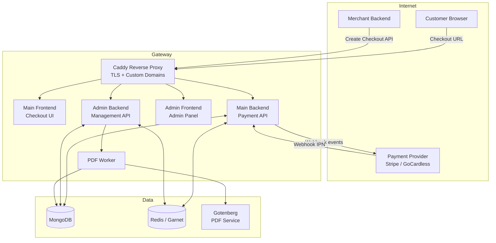
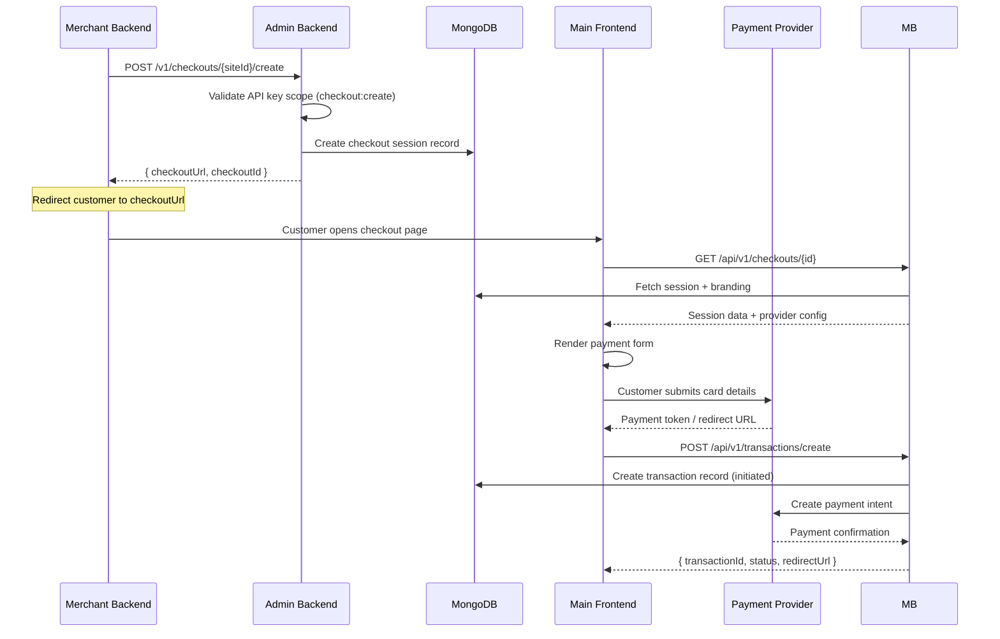
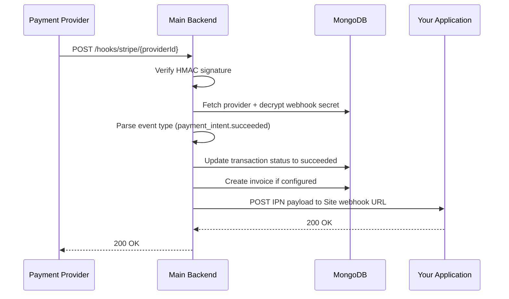
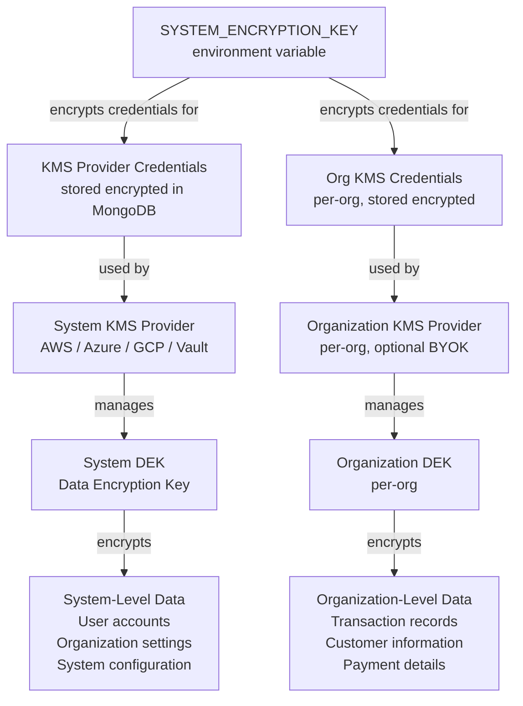
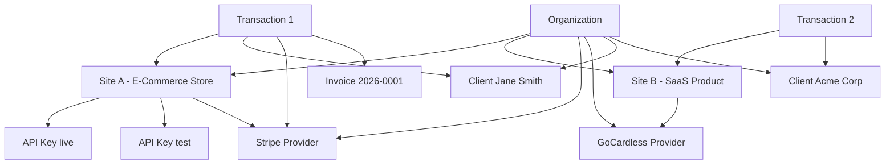
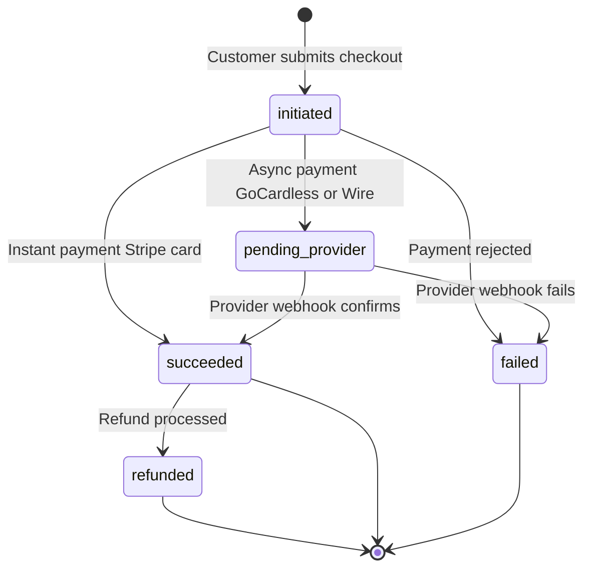
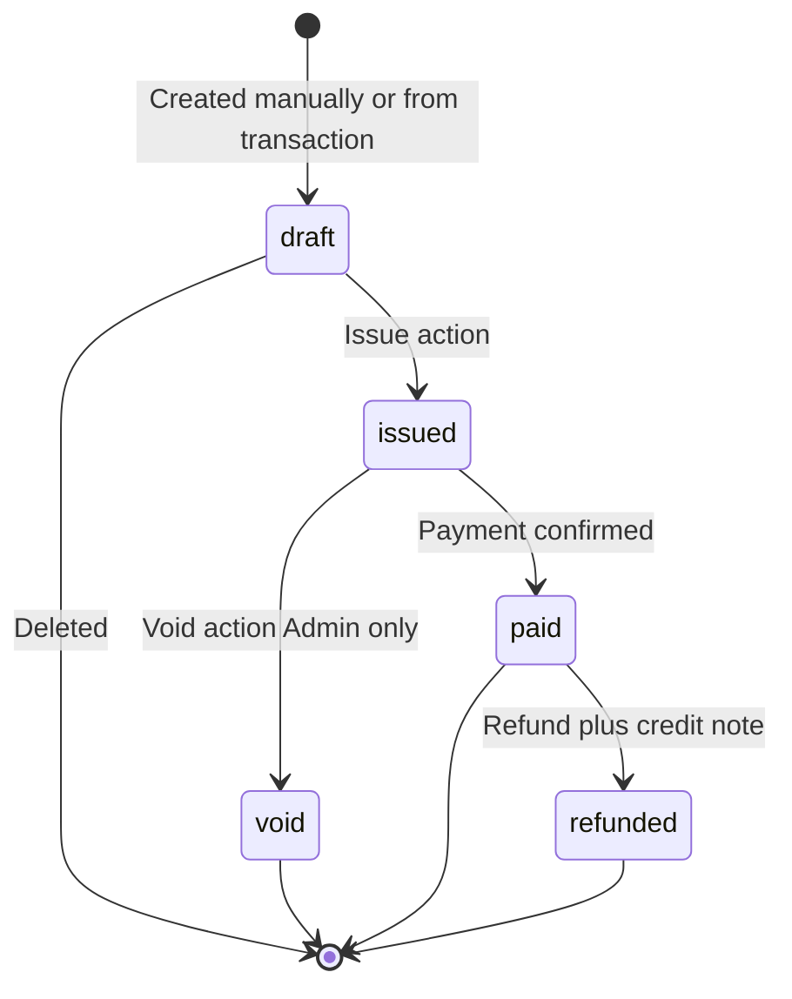

# Architecture Diagrams

## System Overview

---

## Request Flow — Checkout Creation

---

## Request Flow — Webhook to Transaction Update

---

## Encryption Key Hierarchy

---

## Multi-Tenant Data Model

---

## Transaction Lifecycle

---

## Invoice Lifecycle

