# Architecture Diagrams

## System Context

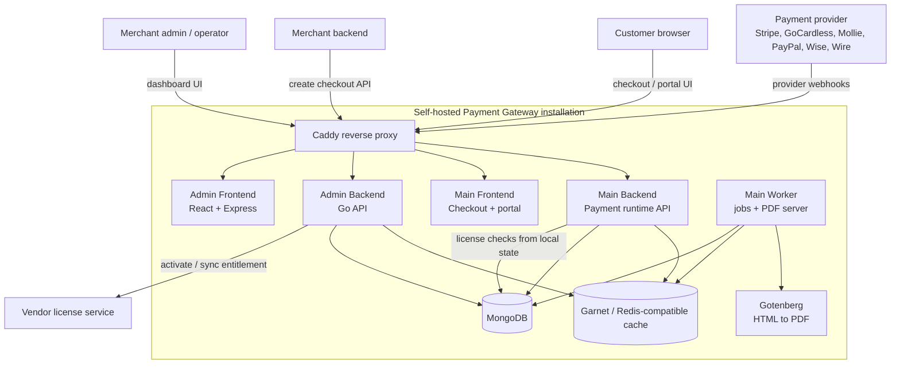

The self-hosted stack is deployed from the Docker Compose package. The installation contacts the vendor license service only for activation and entitlement sync; runtime enforcement is based on the local signed license state stored by the installation.

---

## Docker Compose Topology

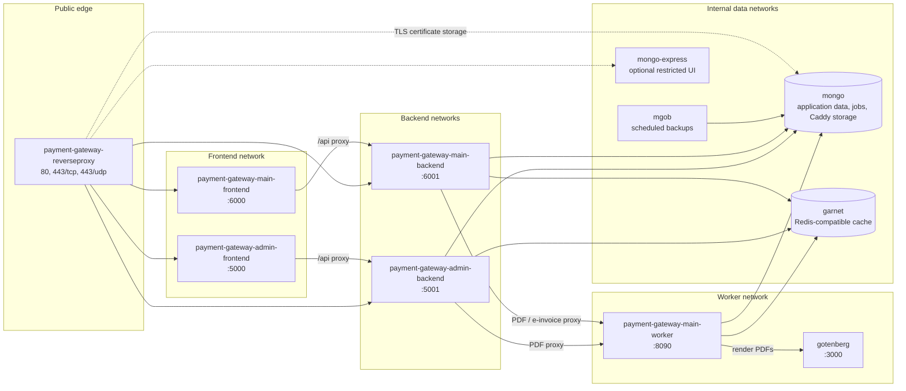

MongoDB is the source of truth for application data and the background `jobs` collection. Garnet is used as a Redis-compatible cache, not as the durable job queue.

---

## Reverse Proxy Routing

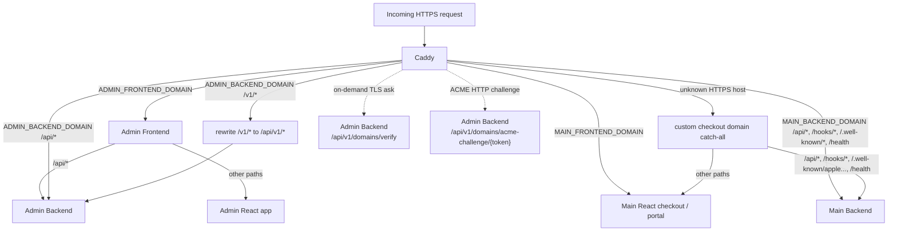

Specific domain blocks are evaluated before the `:443` catch-all. The catch-all enables custom checkout hostnames after the Admin Backend approves them through the Caddy `ask` endpoint.

---

## Checkout Creation And Payment

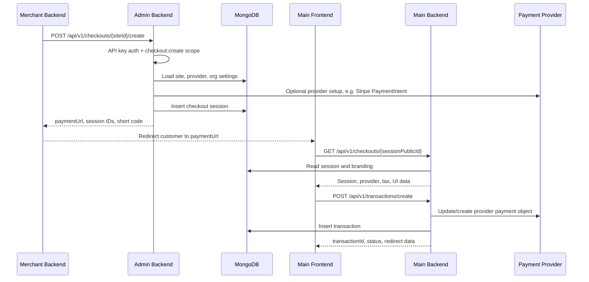

The merchant server creates sessions on the Admin Backend. Customers interact with the Main Frontend and Main Backend. Card data is handled by provider browser SDKs and provider APIs; the gateway stores normalized transaction metadata.

---

## Tax Calculation And Reporting

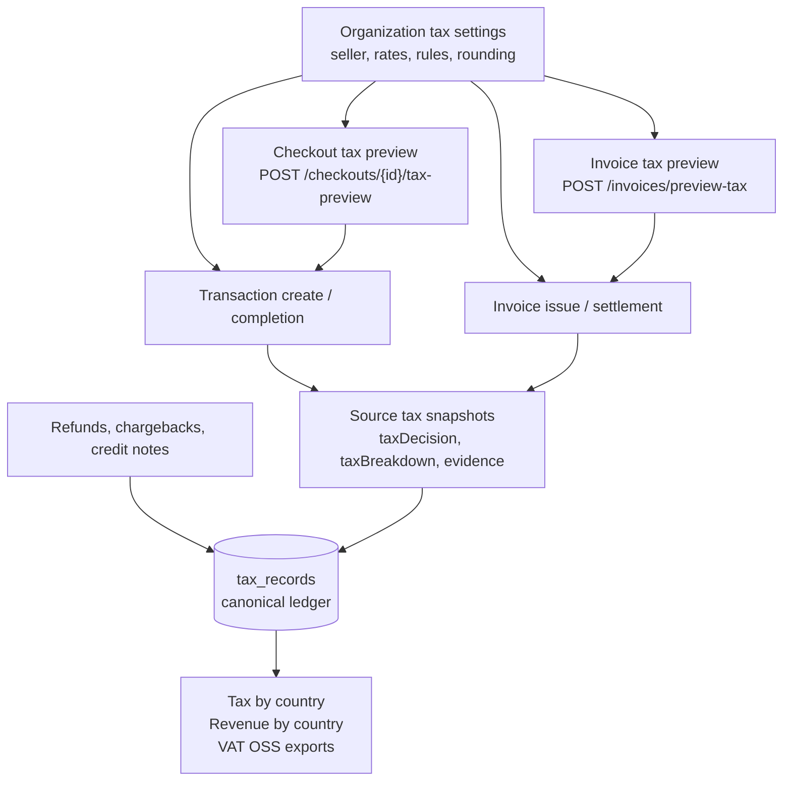

Checkout preview and invoice preview are convenience flows. The authoritative tax state is the snapshot stored on transactions, invoices, credit notes, refunds, and chargebacks, plus the canonical `tax_records` used by tax reports and exports.

---

## Provider Webhook To Side Effects

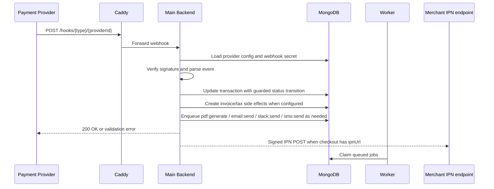

Provider webhook implementations live in the Main Backend provider package. Outbound merchant IPN payloads are signed with the site's webhook secret and record delivery outcomes on the transaction.

---

## Background Job And PDF Flow

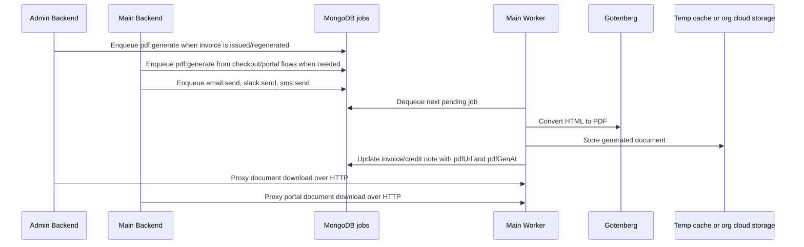

The Worker validates the Gotenberg connection on startup when configured, serves cached documents on its own HTTP port, and reuses the same process for notification delivery jobs.

---

## Licensing Flow

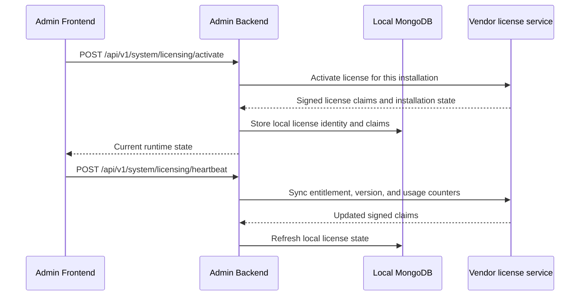

The Admin Backend and Main Backend enforce runtime state locally. If the remote service is temporarily unavailable, the installation continues to use the locally stored signed claims and heartbeat-age rules described on the licensing page.

---

## Encryption Key Hierarchy

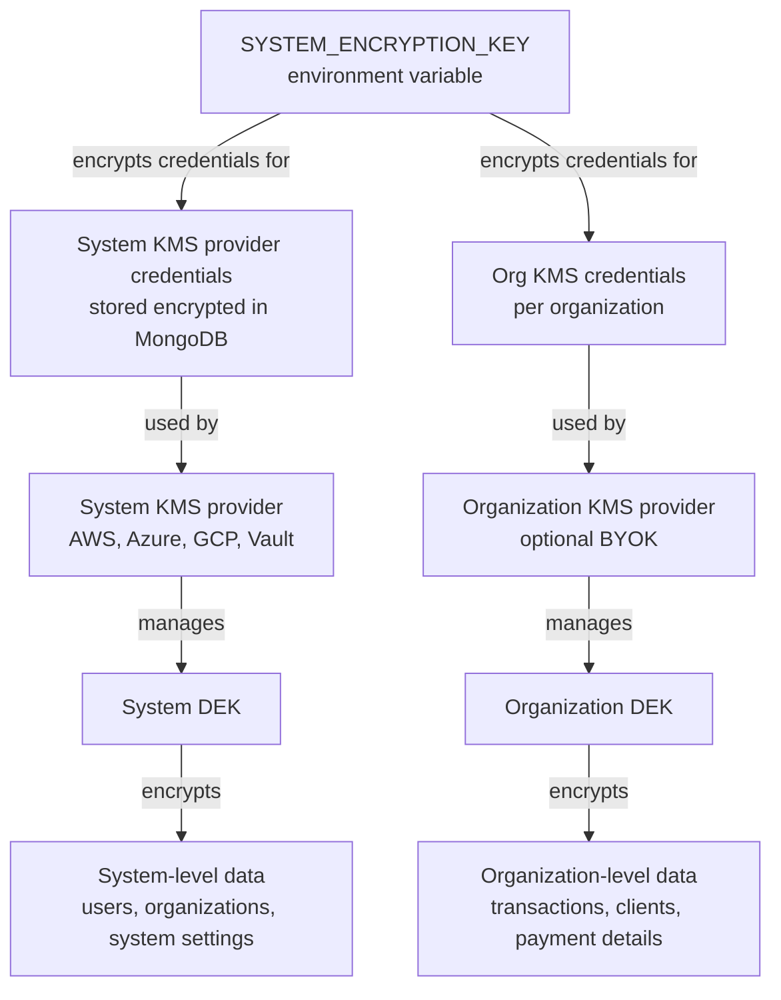

---

## Multi-Tenant Data Model

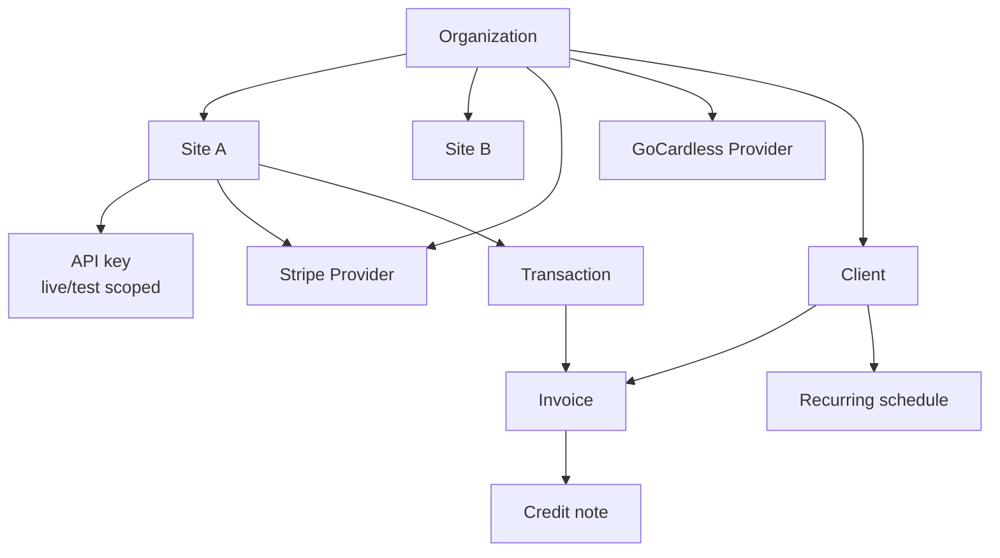

---

## Transaction Lifecycle

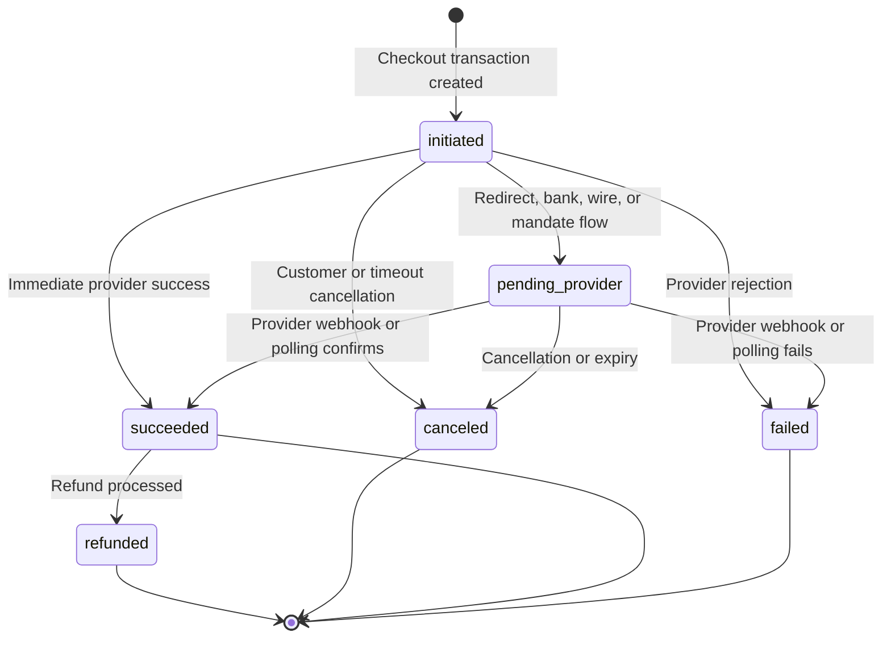

---

## Invoice Lifecycle

