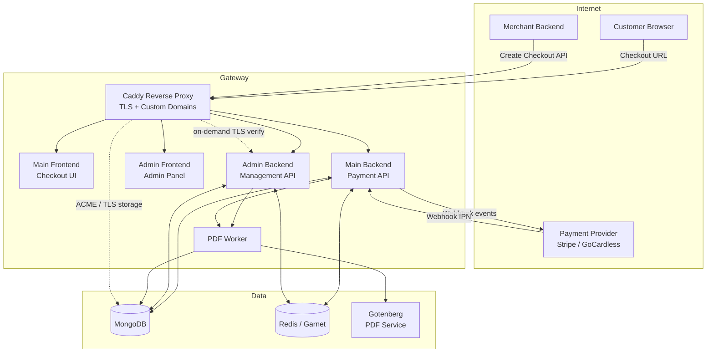
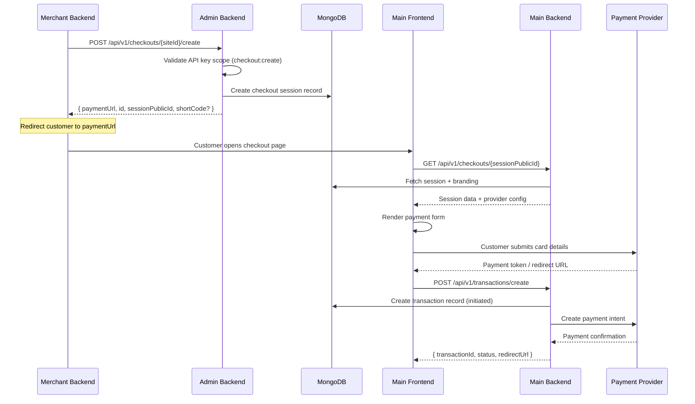
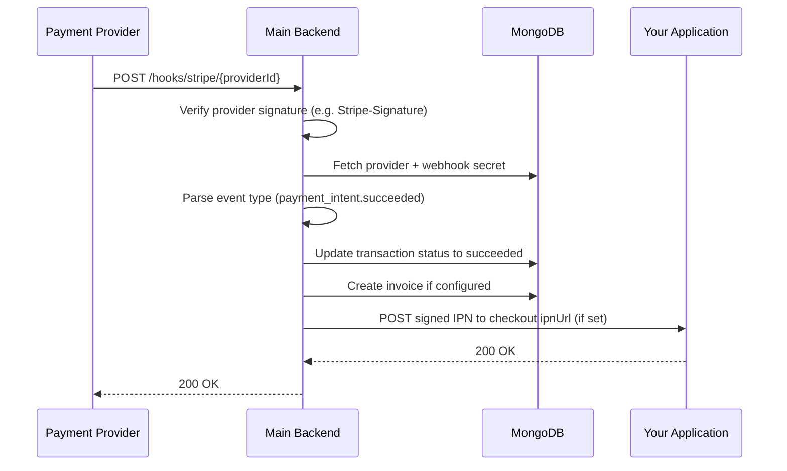
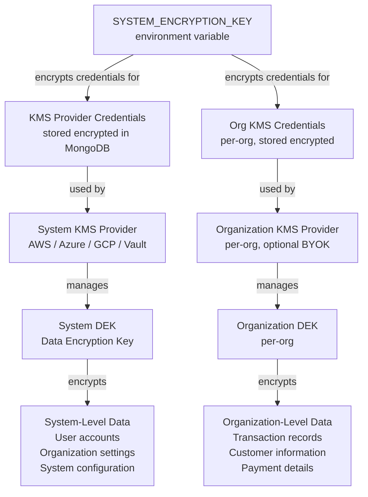
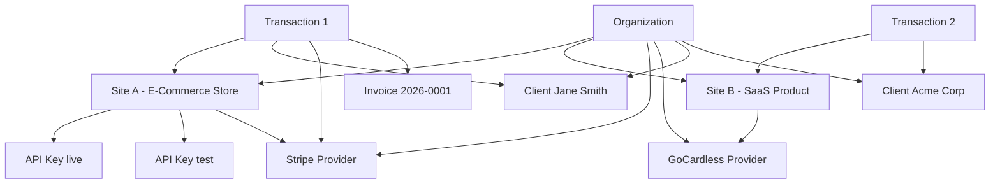
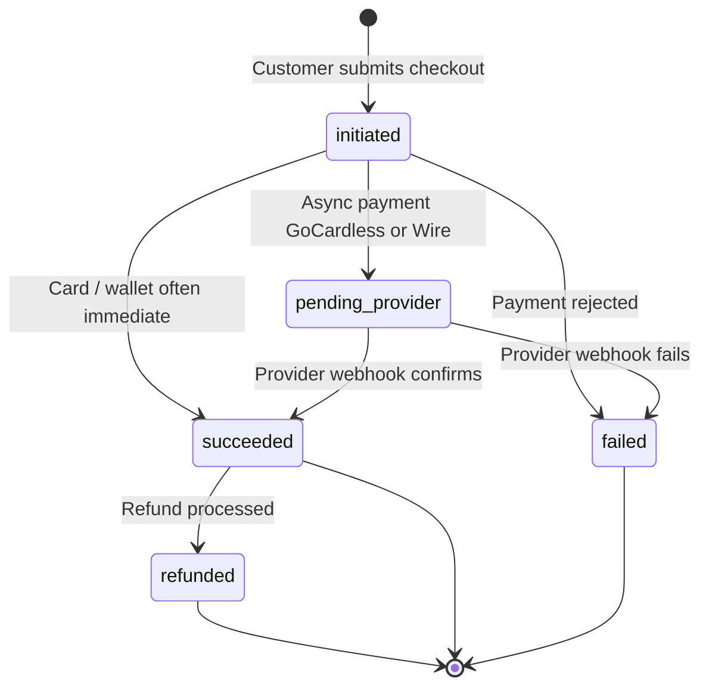
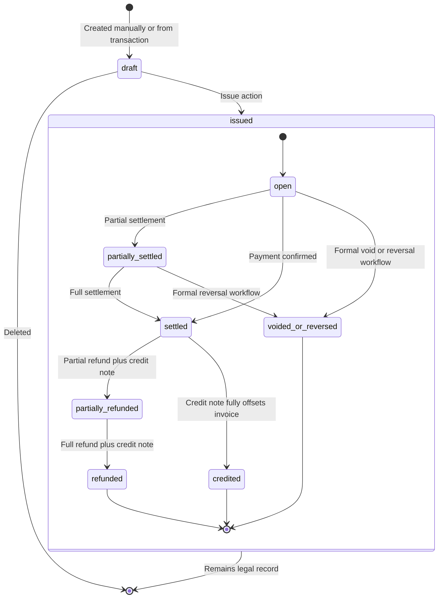

# Architecture Diagrams

## System Overview

Which service receives traffic for a given hostname and path is determined by the default **`payment-gateway-reverseproxy/Caddyfile`**. The diagram **rolls four public hostnames into one Caddy box**: merchant **create-checkout** calls go to **`ADMIN_BACKEND_DOMAIN`**, the customer **checkout UI** to **`MAIN_FRONTEND_DOMAIN`**, checkout **runtime APIs** and **provider webhooks** to **`MAIN_BACKEND_DOMAIN`**, and the **Admin Panel** to **`ADMIN_FRONTEND_DOMAIN`** (with `/api/*` on that host proxied to the Admin Backend — see the Caddyfile). **Mongo Express**, the **`:443` catch-all** for custom checkout domains, and **registry / licensing** traffic are omitted here; see [Hostnames & DNS conventions](../deployment/domains).

The shipped Caddy image uses the **`storage mongodb`** block so certificate metadata is written to the same MongoDB deployment (a separate concern from application collections). For **on-demand TLS**, Caddy’s `ask` URL targets the Admin Backend **`/api/v1/domains/verify`**. **Both** backends proxy invoice PDF bytes from the **Worker** (admin downloads and customer portal flows).

Hosted reference names (`api.payment-gateway.app`, `webhook.payment-gateway.app`, etc.) and self-hosted examples are summarized in [Hostnames & DNS conventions](../deployment/domains). For **which host** to use for merchant server calls vs provider webhooks, follow [Server integration checklist](../getting-started/integration-checklist).

---

## Request Flow — Checkout Creation

> [!NOTE]
> **TLS** terminates at **Caddy** (not shown as a separate hop). In production, the merchant server calls **`ADMIN_BACKEND_DOMAIN`** for `POST …/checkouts/…/create`; the customer opens **`paymentUrl`** on **`MAIN_FRONTEND_DOMAIN`**; the checkout app then calls **`MAIN_BACKEND_DOMAIN`** for `GET`/`POST /api/v1/...` as above. Paths match the Main Backend router under `/api/v1`.

---

## Request Flow — Webhook to Transaction Update

Provider callbacks use **`MAIN_BACKEND_DOMAIN`** with paths under **`/hooks/...`** (no `/api/v1` prefix). The outbound **IPN** to your application is optional and only runs when the checkout specifies an `ipnUrl`.

---

## Encryption Key Hierarchy

---

## Multi-Tenant Data Model

---

## Transaction Lifecycle

---

## Invoice Lifecycle

