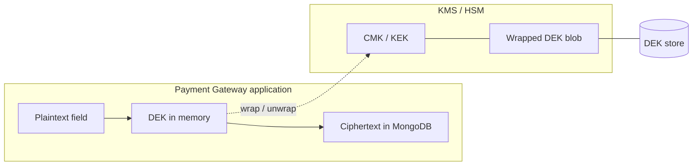
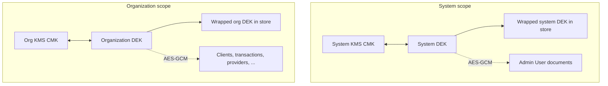

# Encryption Architecture

The Payment Gateway uses **field-level encryption** for sensitive values stored in MongoDB. Configuration is split into **system encryption** (global admin scope) and **organization encryption** (per-tenant scope), each with its own **Data Encryption Key (DEK)** wrapped by a **Key Encryption Key** in your chosen **Key Management Service (KMS)**.

In the Admin UI, **System > Encryption** configures the platform-wide KMS and system DEK; **Settings > Encryption** (inside an organization) configures that tenant’s KMS and organization DEK.

## System vs organization encryption

| Aspect                  | System encryption                                                                                               | Organization encryption                                                                                                                        |
| ----------------------- | --------------------------------------------------------------------------------------------------------------- | ---------------------------------------------------------------------------------------------------------------------------------------------- |
| **Purpose**             | Protects cross-tenant platform data: admin users, and any document handled under the system encryption context. | Protects tenant business data: clients, transactions, invoices, payment provider secrets, notification payloads, and other org-scoped records. |
| **DEK**                 | One **system DEK** for the whole installation.                                                                  | One **organization DEK per organization** (isolated key boundary).                                                                             |
| **KMS**                 | System KMS (e.g. one AWS/Azure/GCP/Vault key for the platform).                                                 | Per-organization KMS configuration (BYOK or a dedicated key for that org).                                                                     |
| **Wrapped DEK storage** | Stored with system scope in the DEK store.                                                                      | Stored per `organizationId` in the DEK store.                                                                                                  |
| **Typical mistake**     | Enabling only system encryption and assuming checkout and client data are covered.                              | Skipping system encryption and leaving admin user PII and platform secrets without a system DEK.                                               |

> [!IMPORTANT]
> For production, configure **both** scopes. System encryption does not replace organization encryption, and organization encryption does not encrypt admin user profiles or other system-scoped data.

## Envelope encryption: what the cloud KMS actually encrypts

**Envelope encryption** here means:

1. The application generates a random **256-bit DEK** (AES key).
2. The **KMS** encrypts (wraps) that DEK using a **CMK** (customer master key). The wrapped DEK and metadata are persisted (for example in MongoDB). This is the **KEK → DEK** step: the CMK is the key encryption key for the data encryption key.
3. For each sensitive field, the application uses the **plaintext DEK in memory** with **AES-256-GCM** to encrypt the field value. Ciphertext, IV, and DEK version are stored on the document.

**Your KMS provider never receives customer payloads, transaction emails, addresses, or provider configuration JSON.** It only performs cryptographic operations on the **DEK material** (wrap/unwrap). Bulk data encryption is always done inside the Payment Gateway process using the unwrapped DEK.

### Rotation vs re-encryption

When you **rotate** the DEK without forcing full re-encryption, the service can **re-wrap the same plaintext DEK** with a new KMS wrapping operation (envelope rotation). A **full re-encryption** path generates a new DEK and requires re-encrypting field data. Exact operations exposed in the UI depend on the rotation mode you choose.

## `SYSTEM_ENCRYPTION_KEY` (environment)

This is a **separate symmetric key** supplied in the environment (`SYSTEM_ENCRYPTION_KEY`). It is **not** the cloud KMS CMK and is **not** used to encrypt business fields directly. **Admin backend, main backend, and worker** deployments must use the **same** key material where the application expects it (the main backend validates this explicitly against the admin deployment).

It is used for **bootstrap and configuration secrets**, including:

- Encrypting **KMS provider credentials** (access keys, client secrets, tokens) before they are stored in encryption configuration documents.
- **Admin API JWT** key material on the admin backend (refresh tokens and cookie signing use separate configured keys).
- Other platform secrets as documented in deployment guides (for example licensing private material marked as encrypted with this key in system settings).

So: **cloud KMS protects the DEK**; **`SYSTEM_ENCRYPTION_KEY` protects KMS credential material, admin JWT signing input, and other bootstrap secrets** at rest in configuration and the database—not your customers’ field ciphertext.

## Field-level encryption mechanics

- **Algorithm:** AES-256-GCM with a random nonce per encryption; additional authenticated data (AAD) binds ciphertext to scope, collection, field name, and DEK version.
- **Storage:** Each `FieldEncrypted` value stores ciphertext, IV, and DEK version in BSON; API responses expose only the decrypted plaintext string to authorized callers.
- **Search:** Selected fields may store a **search hash** (HMAC-based) so the system can query without storing plaintext in indexes.

## Two DEK scopes in code

The DEK service distinguishes:

- **`system`** — `orgID` must be empty; used for system-scoped encryption context.
- **`organization`** — requires `organizationId`; used for all tenant-owned documents processed under org encryption.

KMS `Encrypt`/`Decrypt` calls for wrapping the DEK use AAD derived from scope (and org id for organization scope) so wrapped blobs are bound to their intended context.

## Supported KMS providers

The system integrates with major enterprise key management services via a common KMS provider interface:

- **AWS KMS**
- **Azure Key Vault**
- **Google Cloud KMS**
- **HashiCorp Vault**

## Performance and caching

KMS calls are latency-sensitive. The encryption layer caches **DEK metadata** and **unwrapped DEKs** according to your cache configuration (for example Redis/Garnet or in-memory), reducing repeated unwrap operations while keeping behavior deployment-specific.

## Encryption in notifications (SMTP & IPN)

When the system generates email or IPN payloads, it decrypts `FieldEncrypted` fields using an **organization-scoped** encryption context where the data belongs to a tenant—for example recipient email on notification jobs, billing-related strings on invoice emails, and SMS phone numbers.

## Deployment and operations

- **Multiple processes, one database:** The **admin backend**, **main (checkout) backend**, and **worker** processes all read and write the same MongoDB. Each must run with a consistent configuration so organization- and system-scoped requests can unwrap the correct DEK (environment, KMS reachability, and `SYSTEM_ENCRYPTION_KEY` on services that handle encrypted settings).
- **Backups and restores:** Backups contain **ciphertext** and **wrapped DEKs**. Restoring to a new environment only works if that environment can still reach the **same KMS keys** (or a deliberate key migration has been completed) and has valid bootstrap secrets.
- **Bulk encrypt, decrypt, and re-encrypt:** The Admin UI (**System > Encryption** and **Settings > Encryption**) can start **background jobs** to encrypt existing plaintext fields, decrypt when turning protection off, or **re-encrypt after a full DEK rotation**. Progress and errors are surfaced in the encryption UI; plan maintenance windows for large collections.

On-prem or dedicated HSM-backed KMS (for example **HashiCorp Vault**) follows the same model: the KMS still wraps the DEK only; field payloads are encrypted in the application.

## Related pages

- [Data Processing & Encryption](../deployment/data-processing-encryption) — data categories and representative encrypted fields
- [Data Protection Guide](../deployment/data-protection) — broader self-hosted controls checklist
- [Backup & Recovery (GDPR)](../deployment/backup-recovery)
