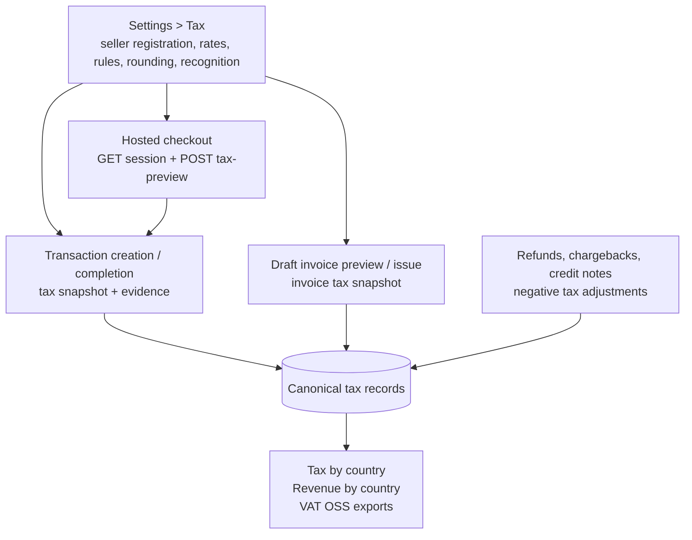
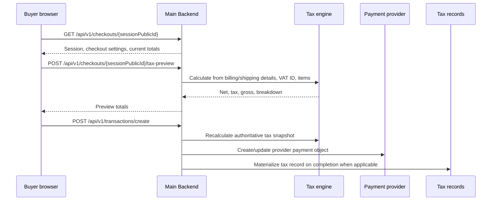
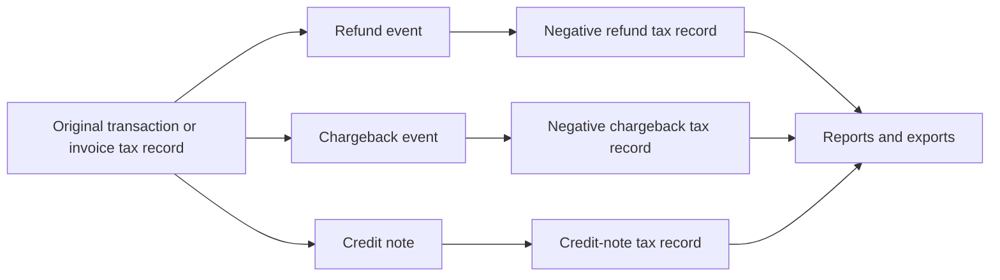

# Invoicing & Tax Architecture

The Payment Gateway combines document lifecycle controls with a configurable tax engine. Tax is not a frontend estimate: checkout previews, transaction creation, manual invoice previews, issued invoices, refunds, chargebacks, and tax reports all use backend tax settings, rates, rules, and immutable tax record snapshots.

## The Invoicing Lifecycle

Invoices enforce a strict immutability rule designed for accounting compliance. They transition through specific statuses:

1. **`draft`**: The invoice is an editable placeholder. It can be fully modified, populated via the `InvoiceCorrectionService`, or deleted entirely without an audit trail.
2. **`issued`**: The invoice becomes a finalized, legal entity. The legal `InvoiceNumber` is permanently assigned. From this point forward, the core contents cannot be mutated.
3. **Void / reversal workflow**: If an issued invoice must be negated, the platform performs a formal void / reversal workflow rather than mutating the invoice in place. The original invoice remains part of the legal record.
4. **Payment state (computed)**: Financial states such as `open`, `partially_settled`, `settled`, `credited`, `overpaid`, or refund-derived states are computed from settlement totals instead of being persisted as a mutable invoice status.

### Invoice Corrections

Once an invoice reaches the `issued` state, standard mutations are blocked. However, minor corrections, such as typographical errors in addresses or missing metadata, can be requested through the invoice correction workflow.

These corrections require a formal reason string, user ID, and timestamp, permanently appending an audit trail to the invoice metadata. Corrections cannot alter line items or financial amounts; changing amounts requires a credit note or reversal workflow.

## Gapless Sequential Numbering

Unlike the legacy `transaction.externalReference`, which holds the merchant-provided identifier, legal invoices require gapless, sequentially incrementing numbers.

The system uses an isolated `invoice_sequences` MongoDB collection to securely `$inc` and format document numbers synchronously. Organizations configure per-document layouts that define prefixes, optional middle text and suffixes, start numbers, digit width, calendar-vs-fiscal year behavior, visible period detail, and reset policy.

Supported layouts include:

- `INV-2026-00001`
- `INV-2026-03-00001`
- `INV-2026-03-27-00001`
- `INV-20260327-00001`
- `INV2027AR00001`

The backend calculates the visible calendar or fiscal period from the actual issue date. Sites inherit the organization-wide numbering layout and sequence policy. They may override prefixes, but they do not create independent per-site sequences or their own fiscal/calendar rules.

## Tax Integration Model

Tax behavior is configured per organization in **Settings > Tax** and then applied consistently across buyer-facing and operator-facing flows.

The platform stores enough tax metadata to explain a calculation later: seller country, buyer country, buyer type, supply type, tax treatment, tax rate code, tax evidence, net amount, tax amount, gross amount, and the source document or transaction.

### Supported Tax Capabilities

- **Configurable rates and rules**: Tax rates are organization-scoped and effective-dated. Tax rules match seller country, buyer country, buyer type, supply type, priority, and active date.
- **EU VAT OSS**: Supports cross-border EU B2C destination-rate handling when OSS is enabled and matching rules/rates are configured. Automatic OSS fallback can use the buyer country's standard rate for EU cross-border B2C sales.
- **EU B2B reverse charge**: VAT IDs can be validated through VIES, and validated EU B2B buyers can be treated as reverse-charge where rules permit it.
- **Small-business exemption**: Organizations can mark themselves exempt and store the legal reference shown on tax decisions and documents.
- **UK VAT handling**: UK VAT rules support B2B reverse charge, digital services, and low-value goods checks when UK VAT configuration is enabled.
- **US and Canada registration settings**: The settings model stores US nexus and Canadian GST/HST/PST registration data. Actual calculation still depends on the tax rates and rules configured for the merchant's scenario.
- **IOSS registration metadata**: IOSS registration fields are available for merchant configuration. Current tax calculation behavior should be validated against the merchant's import workflow before relying on automatic IOSS treatment.

> [!IMPORTANT]
> The gateway calculates and records tax from your configured settings. Merchants remain responsible for confirming that settings, rates, rules, evidence retention, and filings match their legal obligations.

### VAT Rate Versioning

When a tax rate is updated, it is never changed in place. Instead, a new `TaxRate` record is created with an `EffectiveFrom` UTC timestamp. When generating a transaction or invoice, the tax engine resolves the applicable rate against the relevant tax-point timestamp and locks the decimal result onto the source record and canonical tax records.

Tax can be calculated from net prices or extracted from gross prices. The organization-level `pricesIncludeTax` setting is the default, and checkout line items can carry their own amount type. Rounding is centralized through the organization tax rounding method.

### Checkout Tax Preview And Transaction Snapshot

Hosted checkout uses the Main Backend runtime tax preview endpoint before payment submission:

The preview is informational until the transaction is created. On creation and completion, the backend recalculates or materializes the tax snapshot, stores `totalNet`, `totalTax`, `totalGross`, `taxBreakdown`, `taxDecision`, and tax evidence on the transaction, then creates canonical tax records for reporting. Completion tax finalization is serialized per transaction before automatic invoice generation, so repeated checkout status polling or provider callbacks cannot replace tax records out of order. Transactions linked to invoices defer to invoice-side tax handling to avoid double-counting.

### Manual Draft Invoices And Tax Preview

Manual draft invoices, recurring-generated invoices, and transaction tax calculations intentionally share the same backend tax rules.

- If a draft invoice line omits `taxRate`, the backend auto-calculates the rate from seller configuration, buyer billing country, client tax-country fallback, item type, and the effective tax rate at the invoice tax point.
- If a draft invoice line includes `taxRate`, that line is treated as an explicit manual override.
- The Admin API exposes `POST /api/v1/invoices/preview-tax` so dashboard flows and API key integrations can resolve the canonical tax result before creating or updating a draft invoice.

This keeps the operator-facing invoice editor consistent with the transaction tax engine instead of relying on a frontend-only rate guess.

When an invoice is issued, the platform writes canonical tax records for the invoice according to the organization's tax recognition mode:

- `accrual`: tax is recognized at the invoice tax point / issue timing.
- `cash`: tax records are deferred until the invoice is fully settled.

Credit notes create their own tax records that offset the original invoice according to the configured credit-note adjustment mode.

### Checkout VAT Validation Resolution

Checkout VAT ID validation is intentionally split into two layers:

- **Checkout settings** decide the buyer-facing validation preference for a Site or Organization: `none`, `format`, or `vies`.
- **Tax settings** decide whether the merchant is actually allowed to use VIES-backed VAT treatment, via the organization tax capability flags.

At runtime, the Main Backend resolves an **effective checkout VAT validation mode** before the checkout page is rendered:

- `none` stays `none`
- `format` stays `format`
- `vies` stays `vies` only when the organization tax settings have VIES validation enabled
- `vies` is downgraded to `format` when tax VIES capability is disabled

This prevents a hosted checkout from showing successful live VIES validation to a buyer when the backend tax engine would not honor that validation for tax treatment.

In practice, this means:

- merchants configure the preferred checkout UX in **Settings > Checkout**
- merchants configure reverse-charge and VIES tax capability in **Settings > Tax**
- the hosted checkout always consumes the resolved runtime mode exposed by the Main Backend session response

### EU VAT OSS Evidence Retention

Operating under the Union OSS scheme mandates that merchants collect and preserve proof of the buyer's establishment.

When a transaction is categorized as EU B2C cross-border OSS, the engine collects location evidence such as billing country, shipping country, IP geolocation country, payment-method country, and phone-prefix country. If strict OSS evidence mode is enabled, the checkout can be blocked when fewer than two evidence sources are available or when evidence sources conflict. Evidence is stored with the transaction and copied into tax records for audit and reporting.

### Refunds, Chargebacks, And Credit Notes

Tax reporting does not mutate the original sale. Reversals are represented as separate adjustment records.

Refund and fund-impacting chargeback records carry negative net, tax, and gross amounts and link back to the latest sale tax record where available. Their tax-record lines preserve the original line-level country, supply type, and VAT rate code where that source snapshot exists, so mixed physical and virtual sales reverse into the same countries they were originally reported in. When only an aggregate tax breakdown is available, untaxed residual amounts keep their own billing/shipping destination basis, and over-allocated breakdown rows are capped to the recorded adjustment total instead of being balanced with positive lines. Won chargebacks are not reportable reductions: any active chargeback tax record is voided when the dispute is won. Refund-created credit notes keep the legal document trail aligned with the cash movement.

## Canonical Tax Records, Reports, And Rebuilds

For every material tax event, the Admin Backend also persists **canonical tax records** in the `tax_records` MongoDB collection. These rows are the audit trail behind **Tax by country**, **Revenue by country**, and **VAT OSS** screens: they support drill-down from aggregates to recognized net/tax/gross amounts, buyer/tax country, recognition mode (`accrual` or `cash`), and links back to transactions, invoices, credit notes, refunds, or chargebacks.

Report APIs accept an IANA `timezone` for period boundaries and filenames, and a `source` filter where relevant (`transactions`, `invoices`, or `both`). VAT OSS endpoints are keyed by calendar year and quarter. File exports are implemented as `GET` download endpoints: CSV, OSS XML, or Elster CSV for Germany.

The tax settings page exposes **Rebuild Tax Records** for canonical reporting repair. The rebuild is not a blanket "apply today's rules to old accounting documents" action:

- issued invoices and issued credit notes are rebuilt from stored document snapshots, persisted line totals, tax treatment, tax-rate codes, recognition dates, and original document links
- standalone finalized transactions are rebuilt from their stored transaction tax snapshot by default
- invoice-linked transactions are skipped when the invoice has the authoritative tax record, so mixed transaction/invoice reports do not double-count the same sale
- refunds, credit notes, and chargebacks reduce report totals through negative canonical records instead of mutating the original sale
- chargeback credit notes are issued only once the dispute is lost or accepted; open and under-review disputes remain payment-risk adjustments, and won disputes do not create credit notes

A single transaction can still be recalculated explicitly when an operator wants to apply current tax settings to that transaction. Bulk rebuilds are meant to make `tax_records` complete and internally consistent for reporting while preserving historical issued-document accounting.

VAT OSS uses the same active tax records and line-level tax basis as the other reports. Goods and shipping lines resolve destination from shipping country with billing as fallback; virtual/service lines resolve destination from billing country. Mixed physical and virtual documents therefore keep separate line-level countries and rate codes, while document-level country remains summary metadata. EU cross-border B2C lines are OSS candidates; non-EU destination lines are treated as exports and stay out of VAT OSS.
