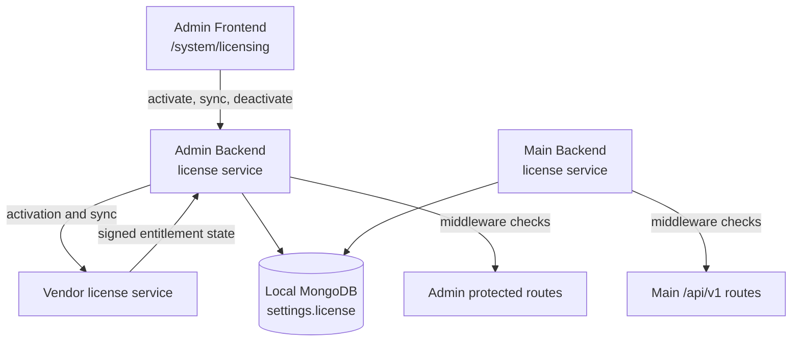

# Licensing Engine

The Payment Gateway uses a signed-license runtime model. During activation and sync, the installation receives signed entitlement claims from the vendor license service. The self-hosted installation stores the local license identity and enforces the evaluated runtime state in the Admin Backend and Main Backend.

## Runtime Architecture

`/api/v1/system/licensing` is intentionally exempt from license blocking so a global admin can activate, sync, or recover a host. Main Backend provider webhooks are registered outside the `/api/v1` group and are handled by provider-specific verification.

## Runtime States

The backend licensing engine evaluates signed license claims and local heartbeat age into runtime states:

| State           | Trigger                                                                                                                                                | Runtime effect                                                                                 |
| --------------- | ------------------------------------------------------------------------------------------------------------------------------------------------------ | ---------------------------------------------------------------------------------------------- |
| `ACTIVE`        | Heartbeat received within 14 days.                                                                                                                     | Full access.                                                                                   |
| `GRACE`         | Heartbeat gap of 14+ days, or missing heartbeat on an otherwise usable local license.                                                                   | Full access. Warnings indicate updates and support need attention.                              |
| `SOFT_LOCK`     | Heartbeat gap of 31+ days.                                                                                                                             | Full access. Informational state; updates and support remain paused.                            |
| `READ_ONLY`     | Heartbeat gap of 45+ days.                                                                                                                             | Full access in the current middleware. Informational state; updates and support remain paused.   |
| `BLOCKED`       | Vendor entitlement reports `BLOCKED`, `REVOKED`, or `SUSPENDED`, or version entitlement policy blocks the reported product version.                      | Protected runtime requests return `403 Forbidden`.                                              |
| `NOT_ACTIVATED` | No usable license key or local license identity is configured.                                                                                          | Protected runtime requests return `403 Forbidden` until activation succeeds.                    |

Only `BLOCKED` and `NOT_ACTIVATED` restrict runtime behavior. `GRACE`, `SOFT_LOCK`, and `READ_ONLY` are warning states in the current implementation.

## Boundary with Merchant Billing

Licensing state controls whether the installation may run protected gateway features. It is separate from merchant billing data created inside the gateway.

Recurring schedules in the gateway create invoices for the merchant's customers only. They do not modify installation license state, support status, update eligibility, or license enforcement state.

## License Tiers

Three commercial tiers are available:

| Tier         | One-time  | Renewal / year | Orgs | Sites     | Support        |
| ------------ | --------- | -------------- | ---- | --------- | -------------- |
| Starter      | 1,490 EUR | 490 EUR        | 1    | Up to 3   | Community      |
| Professional | 2,990 EUR | 990 EUR        | 1    | Unlimited | Email (48 h)   |
| Business     | 7,490 EUR | 2,490 EUR      | 5    | Unlimited | Priority (4 h) |

Promotional purchase pricing may be available on your account or quote. Renewal pricing remains governed by the commercial terms shown for the license.

Additional organisations beyond the tier allowance can be added for 250 EUR per organisation per year. Starter licenses can also add site packs; Professional and Business include unlimited sites.

## Operator Actions

1. **When in `GRACE`, `SOFT_LOCK`, or `READ_ONLY`:**
   - The installation continues to run.
   - Verify outbound connectivity to the configured licensing endpoint.
   - Use **System -> Licensing -> Sync License Now** from the self-hosted admin UI to refresh the local claims.
2. **When in `BLOCKED`:**
   - Confirm whether the license was manually blocked, suspended, revoked, or blocked by version entitlement.
   - Resolve the account, support-window, or version-entitlement issue through your support or account contact.
   - Run **Sync License Now** on the self-hosted installation after the remote state changes.
3. **When in `NOT_ACTIVATED`:**
   - Configure the license key from **System -> Licensing** and complete activation.
   - If activation fails, keep the host clock synchronized and verify the installation can reach the configured licensing endpoint over HTTPS.
4. **General maintenance:**
   - Keep host time synchronized via NTP; clock drift can break token validation or heartbeat freshness.
   - Do not rely on `MPG_LICENSING_BYPASS` outside development builds. The backends only honor bypass when the build version is a development version.
