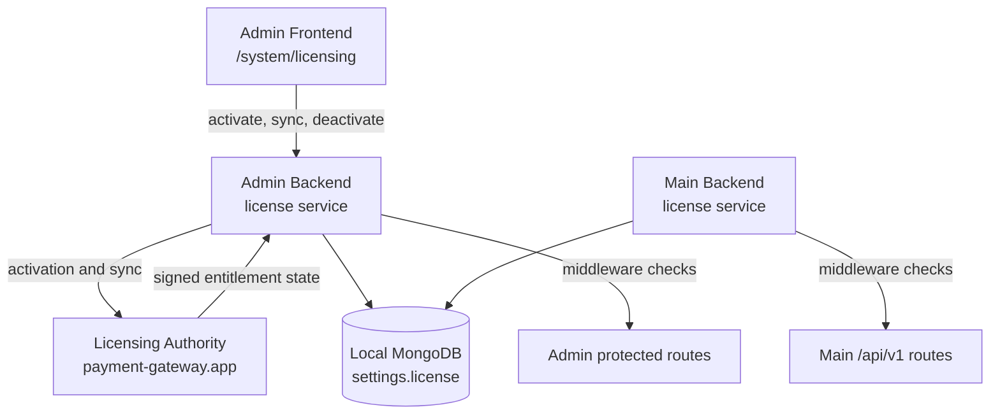

# Licensing Engine

The Payment Gateway uses a signed-license runtime model. During activation and sync, the installation receives signed entitlement claims from the Licensing Authority (`payment-gateway.app`, implemented by `payment-gateway-app-website`). The self-hosted installation stores the local license identity and enforces the evaluated runtime state in the Admin Backend and Main Backend.

## Runtime Architecture

`/api/v1/system/licensing` is intentionally exempt from license blocking so a global admin can activate, sync, deactivate/reset, or recover a host. Main Backend provider webhooks are registered outside the `/api/v1` group and are handled by provider-specific verification.

## Runtime States

The backend licensing engine evaluates signed license claims and local heartbeat age into runtime states:

| State           | Trigger                                                                                                                                                | Runtime effect                                                                                 |
| --------------- | ------------------------------------------------------------------------------------------------------------------------------------------------------ | ---------------------------------------------------------------------------------------------- |
| `ACTIVE`        | Heartbeat received within 14 days.                                                                                                                     | Full access.                                                                                   |
| `GRACE`         | Heartbeat gap of 14+ days, or missing heartbeat on an otherwise usable local license.                                                                   | Full access. Warnings indicate updates and support need attention.                              |
| `SOFT_LOCK`     | Heartbeat gap of 31+ days.                                                                                                                             | Full access. Informational state; updates and support remain paused.                            |
| `READ_ONLY`     | Heartbeat gap of 45+ days.                                                                                                                             | Full access in the current middleware. Informational state; updates and support remain paused.   |
| `BLOCKED`       | Vendor entitlement reports `BLOCKED`, `REVOKED`, or `SUSPENDED`, or version entitlement policy blocks the reported product version.                      | Protected runtime requests return `403 Forbidden`.                                              |
| `NOT_ACTIVATED` | No usable license key or local license identity is configured.                                                                                          | Protected runtime requests return `403 Forbidden` until activation succeeds.                    |

Only `BLOCKED` and `NOT_ACTIVATED` restrict runtime behavior. `GRACE`, `SOFT_LOCK`, and `READ_ONLY` are warning states in the current implementation.

## Boundary with Merchant Billing

Licensing state controls whether the installation may run protected gateway features. It is separate from merchant billing data created inside the gateway.

Recurring schedules in a self-hosted installation create invoices for that merchant's customers. They do not modify the installation's signed license state, support status, update eligibility, or license enforcement state. payment-gateway.app may use a vendor-operated gateway workspace, configured through the app-website billing bridge, to bill product-license customers. Those commercial recurring schedules are not merchant recurring schedules in the customer installation and do not alter local license enforcement. If a bridge resync changes a renewal schedule after invoices have already generated, it must move the next renewal forward rather than rewind onto a current or earlier cycle.

## License Tiers

Three commercial tiers are available:

| Tier         | One-time  | Renewal / year | Orgs | Sites     | Support        |
| ------------ | --------- | -------------- | ---- | --------- | -------------- |
| Starter      | 1,490 EUR | 490 EUR        | 1    | Up to 3   | Community      |
| Professional | 2,990 EUR | 990 EUR        | 1    | Unlimited | Email (48 h)   |
| Business     | 7,490 EUR | 2,490 EUR      | 5    | Unlimited | Priority (4 h) |

Promotional purchase pricing may be available on your account or quote. Renewal pricing remains governed by the commercial terms shown for the license.

Additional organisations beyond the tier allowance can be added for 250 EUR per organisation per year. Starter licenses can also add site packs; Professional and Business include unlimited sites.

## Operator Actions

The deployment runbook is the canonical operator procedure: [Licensing Operations](../deployment/licensing).

At the architecture level, the important boundaries are:

- `GRACE`, `SOFT_LOCK`, and `READ_ONLY` keep runtime access available; operators should fix connectivity and run **System > Licensing > Sync License Now**.
- `BLOCKED` covers manual block, suspension, revocation, and version/support policy block. The remote cause must be cleared before sync can restore access.
- `NOT_ACTIVATED` requires global-admin activation from **System > Licensing**.
